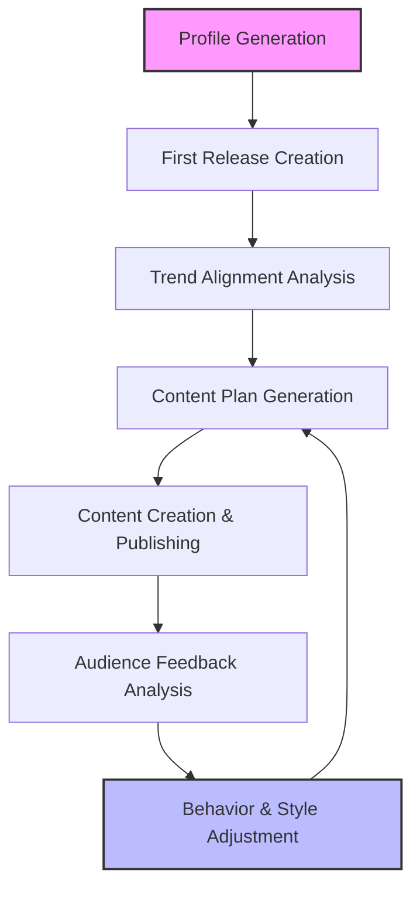

# Artist Flow: Lifecycle of AI Artists

This document describes the complete lifecycle of an AI artist within the AI Artist Creation and Management System, from initial profile generation through ongoing evolution and adaptation.

## Overview

The AI Artist Creation and Management System manages artists through a cyclical process of creation, content generation, performance analysis, and evolution. This document outlines each stage of this process in detail.

## Stage 1: Profile Generation

The first stage in the artist lifecycle is the creation of a comprehensive artist profile.

### Process

1. **Initial Prompt Collection**
   - System receives basic artist concept (genre, style, themes)
   - Optional constraints are defined (target audience, influences, era)

2. **Profile Draft Generation**
   - LLM generates initial artist profile draft
   - Includes name, backstory, musical style, visual aesthetic

3. **Profile Validation**
   - Validator checks for coherence and completeness
   - Ensures all required fields are populated
   - Verifies consistency between elements (e.g., visual style matches musical genre)

4. **Feedback Loop Processing**
   - Any validation issues trigger refinement
   - Multiple iterations may occur until profile meets quality standards

5. **Final Profile Assembly**
   - Complete artist profile is assembled
   - Profile is stored in the database with unique identifier
   - Initial artist assets are generated (profile image, logo, etc.)

### Outputs

- Complete artist profile JSON document
- Artist visual identity assets
- Artist database entry

## Stage 2: First Release Creation

Once an artist profile is established, the system creates the artist's first music release.

### Process

1. **Track Concept Generation**
   - System generates track concept based on artist profile
   - Includes style, mood, tempo, themes, and lyrical direction

2. **Music Generation**
   - Track prompt is sent to music generation service
   - Multiple variations may be generated for selection
   - Best version is selected based on quality metrics

3. **Visual Asset Creation**
   - Cover art is generated to match track concept
   - Additional promotional visuals are created
   - Assets are styled to match artist visual identity

4. **Metadata Preparation**
   - Track title, description, and tags are generated
   - Release information is compiled
   - Distribution metadata is prepared

### Outputs

- Complete music track
- Cover artwork and promotional visuals
- Release metadata package
- Entry in artist's discography

## Stage 3: Trend Alignment Analysis

After initial creation, the system analyzes current trends to position the artist effectively.

### Process

1. **Industry Trend Analysis**
   - System analyzes current music industry trends
   - Identifies popular genres, styles, and themes
   - Maps emerging opportunities in the market

2. **Audience Analysis**
   - Target audience preferences are analyzed
   - Platform-specific trends are identified
   - Engagement patterns are mapped

3. **Competitor Analysis**
   - Similar artists are identified
   - Their performance and strategies are analyzed
   - Differentiation opportunities are identified

4. **Alignment Assessment**
   - Artist profile is compared against trend data
   - Alignment score is calculated
   - Potential adjustment areas are identified

### Outputs

- Trend analysis report
- Alignment score
- Adjustment recommendations
- Market positioning strategy

## Stage 4: Content Plan Generation

Based on the artist profile and trend analysis, a comprehensive content plan is created.

### Process

1. **Release Schedule Planning**
   - Optimal release cadence is determined
   - Key dates and opportunities are identified
   - Platform-specific scheduling is considered

2. **Content Mix Planning**
   - Balance of tracks, videos, and social content is determined
   - Content themes and narrative arc are established
   - Platform-specific content strategy is developed

3. **Collaboration Opportunities**
   - Potential collaboration partners are identified
   - Collaboration concepts are generated
   - Integration into content plan

4. **Resource Allocation**
   - Production resources are allocated across content types
   - Priority content is identified
   - Budget and resource constraints are applied

### Outputs

- Detailed content calendar
- Release schedule
- Content specifications for each planned item
- Resource allocation plan

## Stage 5: Audience Feedback Analysis

After content is published, the system collects and analyzes audience feedback.

### Process

1. **Engagement Data Collection**
   - Platform-specific metrics are collected (plays, likes, shares)
   - Audience demographic data is gathered
   - Comment sentiment analysis is performed

2. **Performance Evaluation**
   - Content performance is measured against benchmarks
   - Comparative analysis against similar artists
   - Identification of over/under-performing content

3. **Audience Sentiment Analysis**
   - Comment and review sentiment is analyzed
   - Key themes in feedback are identified
   - Audience preference patterns are mapped

4. **Market Position Assessment**
   - Artist's position in the market is evaluated
   - Competitive analysis is updated
   - Growth opportunities are identified

### Outputs

- Performance analytics report
- Audience sentiment analysis
   - Sentiment score
   - Key feedback themes
- Market position assessment
- Performance improvement recommendations

## Stage 6: Behavior and Style Adjustment

Based on feedback analysis, the artist's behavior and style are adjusted to optimize performance.

### Process

1. **Adjustment Strategy Formulation**
   - Performance data is translated into adjustment strategy
   - Priority areas for change are identified
   - Magnitude of adjustments is determined

2. **Profile Parameter Tuning**
   - Artist profile parameters are adjusted
   - Changes are subtle to maintain core identity
   - Adjustments are documented for learning

3. **Content Strategy Refinement**
   - Content plan is updated based on performance data
   - Successful content types are emphasized
   - Underperforming approaches are modified

4. **Visual and Sonic Evolution**
   - Visual identity elements may be subtly evolved
   - Sound profile is refined based on feedback
   - Evolution maintains connection to core identity

### Outputs

- Updated artist profile
- Refined content strategy
- Adjusted visual and sonic guidelines
- Evolution documentation

## Stage 7: Cyclical Evolution Process

The artist continues to evolve through repeated cycles of content creation, feedback analysis, and adjustment.

### Process

1. **Continuous Monitoring**
   - Ongoing collection of performance data
   - Regular trend analysis updates
   - Continuous audience sentiment tracking

2. **Periodic Major Reviews**
   - Quarterly comprehensive performance reviews
   - Assessment of evolution trajectory
   - Major strategy adjustments if needed

3. **Long-term Identity Evolution**
   - Gradual, organic evolution of artist identity
   - Maintains core essence while allowing growth
   - Documents evolution journey as part of artist narrative

4. **Learning System Improvement**
   - Performance data feeds back into system learning
   - Adjustment strategies are evaluated for effectiveness
   - System improves prediction and adaptation capabilities

### Outputs

- Evolution timeline documentation
- Performance trend analysis
- System learning improvements
- Long-term artist development strategy

## Integration Points

The artist lifecycle integrates with several key system components:

- **Database System**: Stores artist profiles, content, and performance data
- **LLM Orchestrator**: Manages the generation of creative content and decision-making
- **Content Generation Services**: Creates music, images, and videos
- **Analytics Engine**: Processes performance data and generates insights
- **Distribution System**: Publishes content to various platforms
- **Feedback Collection System**: Gathers audience engagement and sentiment data

## Success Metrics

The artist lifecycle is evaluated based on several key metrics:

- **Audience Growth Rate**: Increase in followers and listeners over time
- **Engagement Metrics**: Likes, shares, comments, and other interaction measures
- **Content Performance**: Streams, views, and other consumption metrics
- **Sentiment Score**: Audience sentiment analysis results
- **Adaptation Effectiveness**: Performance improvements after adjustments
- **Market Position**: Competitive standing in relevant genres and platforms

## Conclusion

The artist lifecycle in the AI Artist Creation and Management System is a continuous process of creation, analysis, and evolution. By systematically moving through these stages, the system creates artists that can adapt to audience preferences and market trends while maintaining a coherent identity and producing high-quality content.
