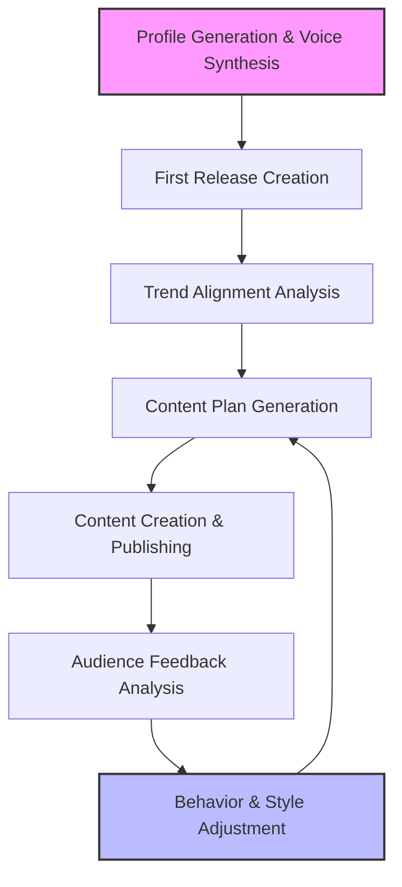

# Artist Flow: Lifecycle of AI Artists

This document describes the complete lifecycle of an AI artist within the AI Artist Creation and Management System, from initial profile generation through ongoing evolution and adaptation.

## Overview

The AI Artist Creation and Management System manages artists through a cyclical process of creation, content generation, performance analysis, and evolution. This document outlines each stage of this process in detail.

## Stage 1: Profile Generation & Voice Synthesis

The first stage in the artist lifecycle is the creation of a comprehensive artist profile, including a unique voice sample.

### Process

1.  **Initial Prompt Collection**
    *   System receives basic artist concept (genre, style, themes).
    *   Optional constraints are defined (target audience, influences, era).

2.  **Profile Draft Generation**
    *   LLM generates initial artist profile draft.
    *   Includes name, backstory, musical style, visual aesthetic, LLM config.

3.  **Profile Validation**
    *   Validator checks for coherence and completeness.
    *   Ensures all required fields are populated.
    *   Verifies consistency between elements (e.g., visual style matches musical genre).

4.  **Feedback Loop Processing**
    *   Any validation issues trigger refinement.
    *   Multiple iterations may occur until profile meets quality standards.

5.  **Final Profile Assembly & Database Storage**
    *   Complete artist profile is assembled.
    *   Profile is stored in the database with unique identifier and `Candidate` status.

6.  **Voice Synthesis (via VoiceService)**
    *   A short text sample is generated based on the artist's name.
    *   The `VoiceService` (using ElevenLabs API with mock fallback) generates a unique voice sample.
    *   The URL of the generated voice sample (`voice_url`) is saved to the artist's database record.

7.  **Initial Asset Generation**
    *   Initial artist assets are generated (profile image, logo, etc.).

### Outputs

*   Complete artist profile JSON document (including `voice_url`).
*   Artist visual identity assets.
*   Artist database entry.
*   Generated voice sample (stored externally, URL in DB).

## Stage 2: First Release Creation (Candidate Run)

Once an artist profile is established (as a `Candidate`), the system creates the artist's first music release to evaluate its potential.

### Process

1.  **Track Concept Generation**
    *   System generates track concept based on artist profile (genre, style notes).
    *   Includes style, mood, tempo, themes, and lyrical direction.
    *   A/B testing variations might be applied to parameters like the music prompt.

2.  **Music Generation & Analysis (via BeatService)**
    *   The `BeatService` orchestrates music generation.
    *   It attempts generation using the primary API (e.g., aimlapi.com) with configured models and fallback logic.
    *   If the primary API fails, it falls back to an alternative API (e.g., Replicate MusicGen, currently mocked).
    *   The generated audio track URL and model used are recorded.
    *   The `BeatService` then uses the `AudioAnalyzer` (librosa) to download and analyze the generated track, extracting tempo (BPM) and duration (seconds).

3.  **Lyrics Generation (via LyricsService)**
    *   The `LyricsService` uses the LLM Orchestrator to generate lyrics.
    *   The prompt includes the track concept, genre, style notes, and crucially, the **tempo and duration** obtained from the `BeatService` analysis to guide the LLM.

4.  **Video Selection**
    *   Keywords derived from the artist profile and track concept are used.
    *   APIs like Pexels and Pixabay are queried (with fallback) to find a suitable background video.
    *   The selected video URL and source are recorded.

5.  **Audio Post-Processing (via ProductionService)**
    *   The generated music track URL is passed to the `ProductionService`.
    *   The `humanize_audio` method applies effects like normalization and subtle background noise overlay (using pydub).
    *   The URL/path of the processed audio is returned (currently a local file path).
    *   *Note: This processed audio is not yet integrated into the final video in this flow.* 

6.  **Preview Assembly & Approval Request**
    *   A preview package (including track URL, lyrics, video URL) is assembled.
    *   The `TelegramService` sends this preview to the designated channel/user for approval.
    *   The system waits for an 'approved' or 'rejected' status update via the run status file.

7.  **Outcome Processing**
    *   **Approved:** The `ReleaseChain` service is triggered to process the approved run data (metadata compilation, potential future packaging/upload steps).
    *   **Rejected/Timeout:** The release is skipped.

8.  **Performance Update & Reflection**
    *   The artist's performance history in the database is updated with the run outcome ('approved' or 'rejected').
    *   Consecutive rejections are tracked.
    *   The LLM Orchestrator reflects on the run (profile, parameters, outcome) to suggest potential adjustments to the artist's `style_notes` or `llm_config`.
    *   These suggestions are applied to the artist's database record.

9.  **Lifecycle Evaluation (via ArtistLifecycleManager)**
    *   The `ArtistLifecycleManager` evaluates the artist's status based on performance (e.g., consecutive rejections).
    *   A `Candidate` artist might be promoted to `Active` after an approval or retired after too many rejections.

### Outputs

*   Generated music track (raw and potentially processed).
*   Generated lyrics aligned with track concept (and potentially timing).
*   Selected background video.
*   Run data including parameters, generated asset URLs, outcome, and reflection suggestions.
*   Updated artist database entry (performance history, potentially status, style notes, LLM config).
*   (If approved) Input for the `ReleaseChain` process.

## Stage 3: Trend Alignment Analysis

After initial creation and potential promotion to `Active`, the system analyzes current trends to position the artist effectively.

### Process

1.  **Industry Trend Analysis**
    *   System analyzes current music industry trends.
    *   Identifies popular genres, styles, and themes.
    *   Maps emerging opportunities in the market.

2.  **Audience Analysis**
    *   Target audience preferences are analyzed.
    *   Platform-specific trends are identified.
    *   Engagement patterns are mapped.

3.  **Competitor Analysis**
    *   Similar artists are identified.
    *   Their performance and strategies are analyzed.
    *   Differentiation opportunities are identified.

4.  **Alignment Assessment**
    *   Artist profile is compared against trend data.
    *   Alignment score is calculated.
    *   Potential adjustment areas are identified.

### Outputs

*   Trend analysis report.
*   Alignment score.
*   Adjustment recommendations.
*   Market positioning strategy.

## Stage 4: Content Plan Generation

Based on the artist profile and trend analysis, a comprehensive content plan is created.

### Process

1.  **Release Schedule Planning**
    *   Optimal release cadence is determined.
    *   Key dates and opportunities are identified.
    *   Platform-specific scheduling is considered.

2.  **Content Mix Planning**
    *   Balance of tracks, videos, and social content is determined.
    *   Content themes and narrative arc are established.
    *   Platform-specific content strategy is developed.

3.  **Collaboration Opportunities**
    *   Potential collaboration partners are identified.
    *   Collaboration concepts are generated.
    *   Integration into content plan.

4.  **Resource Allocation**
    *   Production resources are allocated across content types.
    *   Priority content is identified.
    *   Budget and resource constraints are applied.

### Outputs

*   Detailed content calendar.
*   Release schedule.
*   Content specifications for each planned item.
*   Resource allocation plan.

## Stage 5: Audience Feedback Analysis

After content is published, the system collects and analyzes audience feedback.

### Process

1.  **Engagement Data Collection**
    *   Platform-specific metrics are collected (plays, likes, shares).
    *   Audience demographic data is gathered.
    *   Comment sentiment analysis is performed.

2.  **Performance Evaluation**
    *   Content performance is measured against benchmarks.
    *   Comparative analysis against similar artists.
    *   Identification of over/under-performing content.

3.  **Audience Sentiment Analysis**
    *   Comment and review sentiment is analyzed.
    *   Key themes in feedback are identified.
    *   Audience preference patterns are mapped.

4.  **Market Position Assessment**
    *   Artist's position in the market is evaluated.
    *   Competitive analysis is updated.
    *   Growth opportunities are identified.

### Outputs

*   Performance analytics report.
*   Audience sentiment analysis.
    *   Sentiment score.
    *   Key feedback themes.
*   Market position assessment.
*   Performance improvement recommendations.

## Stage 6: Behavior and Style Adjustment

Based on feedback analysis, the artist's behavior and style are adjusted to optimize performance.

### Process

1.  **Adjustment Strategy Formulation**
    *   Performance data is translated into adjustment strategy.
    *   Priority areas for change are identified.
    *   Magnitude of adjustments is determined.

2.  **Profile Parameter Tuning**
    *   Artist profile parameters are adjusted (via reflection suggestions or direct analysis).
    *   Changes are subtle to maintain core identity.
    *   Adjustments are documented for learning.

3.  **Content Strategy Refinement**
    *   Content plan is updated based on performance data.
    *   Successful content types are emphasized.
    *   Underperforming approaches are modified.

4.  **Visual and Sonic Evolution**
    *   Visual identity elements may be subtly evolved.
    *   Sound profile is refined based on feedback.
    *   Evolution maintains connection to core identity.

### Outputs

*   Updated artist profile.
*   Refined content strategy.
*   Adjusted visual and sonic guidelines.
*   Evolution documentation.

## Stage 7: Cyclical Evolution Process (Active Artists)

The artist continues to evolve through repeated cycles of content creation (similar to Stage 2 but for `Active` artists), feedback analysis, and adjustment.

### Process

1.  **Continuous Monitoring**
    *   Ongoing collection of performance data.
    *   Regular trend analysis updates.
    *   Continuous audience sentiment tracking.

2.  **Periodic Major Reviews**
    *   Quarterly comprehensive performance reviews.
    *   Assessment of evolution trajectory.
    *   Major strategy adjustments if needed.

3.  **Long-term Identity Evolution**
    *   Gradual, organic evolution of artist identity.
    *   Maintains core essence while allowing growth.
    *   Documents evolution journey as part of artist narrative.

4.  **Learning System Improvement**
    *   Performance data feeds back into system learning.
    *   Adjustment strategies are evaluated for effectiveness.
    *   System improves prediction and adaptation capabilities.

5.  **Lifecycle Management**
    *   The `ArtistLifecycleManager` periodically checks all artists.
    *   Artists can be retired based on sustained poor performance (e.g., consecutive rejections).
    *   New artists (`Candidates`) are created probabilistically or when the pool of `Active` artists is low.

### Outputs

*   Evolution timeline documentation.
*   Performance trend analysis.
*   System learning improvements.
*   Long-term artist development strategy.

## Integration Points

The artist lifecycle integrates with several key system components:

*   **Database System (`ArtistDBService`)**: Stores artist profiles, content, and performance data.
*   **LLM Orchestrator**: Manages the generation of creative content (lyrics, reflection) and decision-making.
*   **Music Generation Services (`BeatService`, `AltMusicClient`, Primary Client)**: Creates music tracks using various APIs with fallback and analysis.
*   **Voice Generation Service (`VoiceService`)**: Creates unique voice samples for artists.
*   **Audio Analysis (`AudioAnalyzer`)**: Extracts tempo and duration from audio.
*   **Audio Post-Processing (`ProductionService`)**: Applies effects like normalization and noise.
*   **Video Selection Service**: Selects background videos from Pexels/Pixabay.
*   **Telegram Service**: Handles communication for previews and approvals.
*   **Release Chain**: Processes approved content for potential release.
*   **Artist Lifecycle Manager**: Manages artist status (Candidate, Active, Retired).
*   **Analytics Engine**: Processes performance data and generates insights (partially implemented via reflection).
*   **Distribution System**: Publishes content to various platforms (future implementation).
*   **Feedback Collection System**: Gathers audience engagement and sentiment data (future implementation).

## Success Metrics

The artist lifecycle is evaluated based on several key metrics:

*   **Approval Rate**: Percentage of generated content previews approved.
*   **Audience Growth Rate**: Increase in followers and listeners over time (future metric).
*   **Engagement Metrics**: Likes, shares, comments, and other interaction measures (future metric).
*   **Content Performance**: Streams, views, and other consumption metrics (future metric).
*   **Sentiment Score**: Audience sentiment analysis results (future metric).
*   **Adaptation Effectiveness**: Performance improvements after adjustments (measured by approval rate changes).
*   **Market Position**: Competitive standing in relevant genres and platforms (future metric).

## Conclusion

The artist lifecycle in the AI Artist Creation and Management System is a continuous process of creation, analysis, and evolution. By systematically moving through these stages, the system creates artists that can adapt to audience preferences and market trends while maintaining a coherent identity and producing high-quality content. The recent enhancements focus on improving the robustness and quality of the content generation pipeline (Stage 2) through API fallbacks, audio analysis for lyric alignment, voice synthesis, and audio post-processing.

