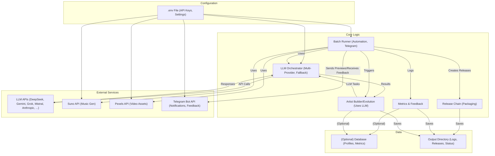

# AI Artist Platform - Production Ready v1.0

## Project Description

The AI Artist Platform is a comprehensive system designed to autonomously generate, manage, and evolve AI-powered virtual music artists. It creates unique artist identities, orchestrates content creation (music, visuals), analyzes performance, and adapts based on data-driven insights and feedback, aiming to explore the potential of autonomous creative systems in the music industry.

## System Architecture (Phase 8 Final)

The system employs a modular architecture focused on a continuous evolution loop, enhanced with multi-provider LLM support, API integration, resilience mechanisms (retry/fallback), and feedback processing.

For a detailed breakdown, refer to:
*   `/docs/system_state/architecture.md` (High-level overview)
*   `/docs/system_state/llm_support.md` (LLM providers and orchestration)
*   `/docs/system_state/api_key_mapping.md` (API credential usage)
*   `/docs/architecture/` (Older, more detailed diagrams - may require updates)

**Simplified Flow:**

1.  **Configuration:** Uses `.env` for API keys and settings.
2.  **Artist Generation/Evolution:** `artist_builder` (or future refactored module) uses `LLMOrchestrator` to create/update profiles.
3.  **LLM Orchestration:** `llm_orchestrator` interacts with DeepSeek, Gemini, Grok, Mistral, Anthropic, OpenAI (optional) using keys from `.env`, with retry, fallback, and auto-discovery logic.
4.  **Content Prompting:** `artist_flow/generators` create prompts for music/video.
5.  **External APIs:** `api_clients` interact with Suno (music) and Pexels (video assets).
6.  **Batch Processing:** `batch_runner` automates generation cycles, sends Telegram previews (requires `TELEGRAM_BOT_TOKEN` & `TELEGRAM_CHAT_ID`), and processes feedback.
7.  **Release Packaging:** `release_chain` prepares approved content runs.
8.  **Metrics & Feedback:** `metrics` module logs performance and feedback.
9.  **Evolution:** `artist_evolution` service analyzes data and adapts artists (partially implemented).



## Directory Structure (Phase 8 Final)

```
noktvrn_ai_artist/
├── .env                  # Local environment variables (DO NOT COMMIT)
├── .env.example          # Environment variables template
├── .github/              # GitHub Actions workflows
├── .gitignore
├── api_clients/          # Clients for external APIs (Suno, Pexels, Base)
├── analytics/            # Performance data handling (DB service, Stock Tracker)
├── artist_evolution/     # Artist profile evolution logic, style adaptation
├── batch_runner/         # Automated generation cycle runner
├── database/             # DB connection and schema (Optional)
├── docs/                 # Documentation (Architecture, Development, System State, etc.)
│   ├── architecture/
│   ├── deployment/
│   ├── development/
│   ├── system_state/     # Current state docs (API Keys, LLM Support, Arch)
│   └── ...
├── llm_orchestrator/     # Multi-provider LLM interaction handler
├── logs/                 # Log file output directory (if configured)
├── metrics/              # Metrics logging and feedback analysis
├── output/               # Default dir for generated outputs (run status, releases, etc.)
├── release_chain/        # Logic for packaging approved runs into releases
├── release_uploader/     # Logic for preparing releases for upload/deployment (Placeholder)
├── requirements.txt      # Python dependencies
├── scripts/              # Utility & operational scripts
├── tests/                # Unit and integration tests
├── utils/                # Common utilities (retry decorator, health checker)
├── video_processing/     # Audio analysis and video selection logic
├── CONTRIBUTION_GUIDE.md # Contribution guidelines
└── README.md             # This file

# --- Potentially Stale/Overlapping Modules (Require Review/Refactoring) ---
# artist_builder/
# artist_creator/
# artist_manager/
# artist_flow/
# templates/
# video_gen_config/
# --------------------------------------------------------------

streamlit_app/            # Streamlit frontend application (Separate Deployment)
├── .env                  # Environment variables for Streamlit (DO NOT COMMIT)
├── .env.example          # Streamlit environment variables template
├── requirements.txt      # Streamlit dependencies
├── app.py                # Main Streamlit application entry point
├── services/             # Services used by Streamlit (e.g., Telegram)
├── monitoring/           # Batch Runner monitoring dashboard
└── ...                   # Other UI components
```

## Setup and Usage

### Prerequisites

*   Python 3.10+
*   Docker & Docker Compose (Recommended for simplified setup)
*   FFmpeg (Required for some audio/video operations, install system-wide)
*   API keys/credentials for: Suno.ai, Pexels, DeepSeek, Gemini, Grok, Mistral, Anthropic (optional), Telegram Bot.
*   A specific Telegram Chat ID where the bot will operate.

### Environment Setup

1.  **Clone:** `git clone https://github.com/pavelraiden/noktvrn_ai_artist.git`
2.  **Navigate:** `cd noktvrn_ai_artist`
3.  **Configure `.env`:**
    *   Copy `noktvrn_ai_artist/.env.example` to `noktvrn_ai_artist/.env`.
    *   Fill in **all** required credentials (API keys, `TELEGRAM_CHAT_ID`, `OUTPUT_BASE_DIR`).
    *   If using the Streamlit app, also copy `streamlit_app/.env.example` to `streamlit_app/.env` and fill in credentials.
4.  **Install Dependencies (if not using Docker):**
    ```bash
    python -m venv venv
    source venv/bin/activate # or venv\Scripts\activate on Windows
    pip install -r requirements.txt
    # If using Streamlit app: pip install -r streamlit_app/requirements.txt
    # Ensure ffmpeg is installed and in your system PATH
    ```

### Running the System

**Option 1: Docker Compose (Recommended)**

1.  Ensure Docker and Docker Compose are installed and running.
2.  Ensure `noktvrn_ai_artist/.env` (and `streamlit_app/.env` if used) are correctly populated.
3.  From the `noktvrn_ai_artist` directory, run:
    ```bash
    docker-compose up --build -d
    ```
4.  This typically starts the main application components and the Streamlit UI.
5.  Access Streamlit UI (usually `http://localhost:8501`).
6.  Monitor logs: `docker-compose logs -f`

**Option 2: Manual Execution (Example: Batch Runner)**

1.  Ensure dependencies are installed and the virtual environment is active.
2.  Ensure `noktvrn_ai_artist/.env` is correctly populated.
3.  Run a specific component, e.g., the batch runner:
    ```bash
    python batch_runner/artist_batch_runner.py
    ```

## Contribution Guide

Contributions are welcome! Please read our [Contribution Guide](CONTRIBUTION_GUIDE.md) for details on code standards, development workflow, testing, documentation, and the core principle of building a self-evolving system.

## Project Status (Phase 8 Final - Production Ready v1.0)

*   **Status:** Core integration complete. Ready for initial production testing.
*   **Key Features:** Multi-LLM support (DeepSeek, Gemini, Grok, Mistral) with fallback, integrated production API keys, automated batch processing with Telegram feedback loop, metrics logging, release packaging.
*   **Known Issues/Placeholders:**
    *   `TELEGRAM_CHAT_ID` requires manual configuration in `.env`.
    *   Intelligent LLM routing is a placeholder.
    *   Several older modules (`artist_builder`, etc.) need review/refactoring.
    *   `Release Uploader` performs dummy uploads.
    *   Database integration is optional and requires setup.
*   **Next Steps:** Production testing, monitoring, addressing placeholders, refining evolution logic, implementing data pipelines.

For a detailed history, see `docs/development/dev_diary.md`.
