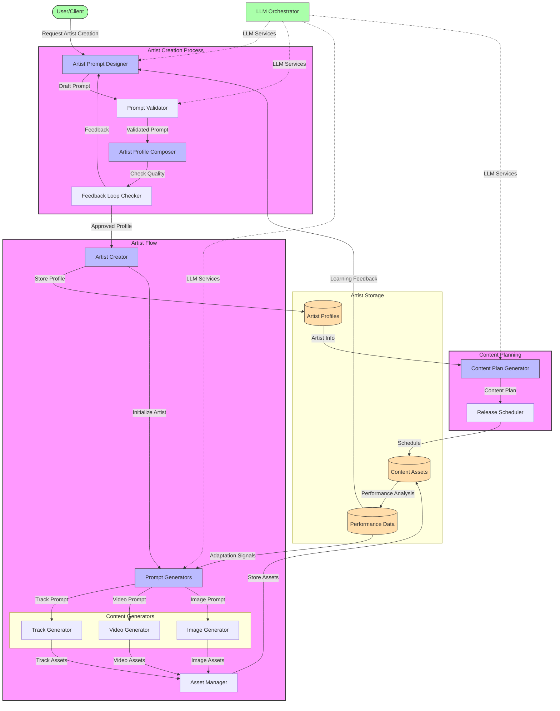

```mermaid
flowchart TD
    %% Main components
    User([User/Client])
    LLM[LLM Orchestrator]
    
    %% Artist Creation Flow
    subgraph ArtistCreation[Artist Creation Process]
        ArtistPrompt[Artist Prompt Designer]
        ArtistProfile[Artist Profile Composer]
        ArtistValidator[Prompt Validator]
        FeedbackLoop[Feedback Loop Checker]
    end
    
    %% Artist Flow
    subgraph ArtistFlow[Artist Flow]
        ArtistCreator[Artist Creator]
        AssetManager[Asset Manager]
        PromptGenerators[Prompt Generators]
        subgraph Generators[Content Generators]
            TrackGen[Track Generator]
            VideoGen[Video Generator]
            ImageGen[Image Generator]
        end
    end
    
    %% Content Planning
    subgraph ContentPlanning[Content Planning]
        ContentPlanGenerator[Content Plan Generator]
        ReleaseScheduler[Release Scheduler]
    end
    
    %% Storage
    subgraph Storage[Artist Storage]
        ArtistData[(Artist Profiles)]
        ContentData[(Content Assets)]
        PerformanceData[(Performance Data)]
    end
    
    %% Flow connections
    User -->|Request Artist Creation| ArtistPrompt
    ArtistPrompt -->|Draft Prompt| ArtistValidator
    ArtistValidator -->|Validated Prompt| ArtistProfile
    ArtistProfile -->|Check Quality| FeedbackLoop
    FeedbackLoop -->|Feedback| ArtistPrompt
    FeedbackLoop -->|Approved Profile| ArtistCreator
    
    ArtistCreator -->|Store Profile| ArtistData
    ArtistCreator -->|Initialize Artist| PromptGenerators
    
    PromptGenerators -->|Track Prompt| TrackGen
    PromptGenerators -->|Video Prompt| VideoGen
    PromptGenerators -->|Image Prompt| ImageGen
    
    TrackGen -->|Track Assets| AssetManager
    VideoGen -->|Video Assets| AssetManager
    ImageGen -->|Image Assets| AssetManager
    
    AssetManager -->|Store Assets| ContentData
    
    %% Content Planning connections
    ArtistData -->|Artist Info| ContentPlanGenerator
    ContentPlanGenerator -->|Content Plan| ReleaseScheduler
    ReleaseScheduler -->|Schedule| ContentData
    
    %% LLM connections
    LLM -.->|LLM Services| ArtistPrompt
    LLM -.->|LLM Services| ArtistValidator
    LLM -.->|LLM Services| PromptGenerators
    LLM -.->|LLM Services| ContentPlanGenerator
    
    %% Performance feedback loop
    ContentData -->|Performance Analysis| PerformanceData
    PerformanceData -->|Adaptation Signals| PromptGenerators
    PerformanceData -->|Learning Feedback| ArtistPrompt
    
    %% Style definitions
    classDef primary fill:#f9f,stroke:#333,stroke-width:2px;
    classDef secondary fill:#bbf,stroke:#333,stroke-width:1px;
    classDef storage fill:#fda,stroke:#333,stroke-width:1px;
    classDef external fill:#afa,stroke:#333,stroke-width:1px;
    
    class ArtistCreation,ArtistFlow,ContentPlanning primary;
    class ArtistPrompt,ArtistProfile,ArtistCreator,PromptGenerators,ContentPlanGenerator secondary;
    class ArtistData,ContentData,PerformanceData storage;
    class User,LLM external;
```
